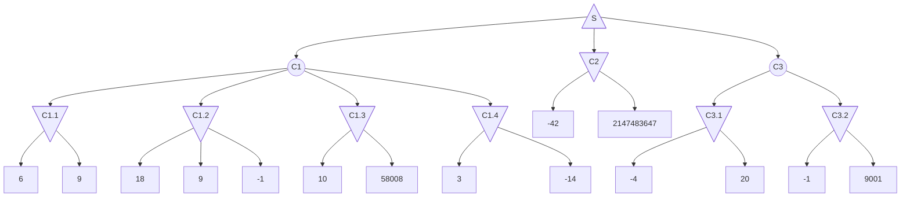

# Solucion parcial 2 (16 Diciembre 2024)

## Ejercicio 1

### 1.1

Generamos episodios (le llamo E al conjunto).

A partir de los episodios obtenemos los estados alcansables $s\in S$

Estimamos la probabilidad de cada transición $P(s'|s,a) = \frac{ocurrencias\ (s,\ a,\ \dot,\ s')\ en E}{ocurrencias\ (s,a) en E}$

Estimamos la recompenza de cada transcición $R(s'|s,a) = \frac{suma\ de\ las\ recompenzas\ (s,\ a,\ r,\ s')\ en E}{ocurrencias\ (s,\ a,\ r,\ s')\ en E}$

O en su defecto dar un ejemplo con 2 o 3 episodios con los calculos hechos.

### 1.2

El parametro que le pasamos a $TD(\lambda)$ es un entero que representa cuanto "espera" el algoritmo para actualizar los valores de estados, o sea, que tan a futuro mira antes de actualizar.

- $TD(0) actualiza en cada paso.
- $TD(\inf)$ es equivalente a Monte Carlo.

### 1.3

Q-Learning es TD(0) donde se estima la función de valor de estado-acción $Q(s,a)$, y se actualiza a medida de que ejecutamos el episodio.

## Ejercicio 2

### 2.1

Un juego de suma 0 es aquel en el que la suma de las recompenzas de los agentes es 0, o sea, si un agente gana, el otro pierde.

### 2.2

Minimax nos define una cota superior del resultado en el caso de que el oponente juegue perfectamente.

### 2.3

El algoritmo explora ramas del arbol de forma exponencial. Una solución para este problema es limitar la profundidad del mismo. Pero esto dificulta la comparacion de distintos estados no terminales, ya que no siempre sabemos a simple vista cual es el mejor. Para eso usamos una función de evaluación que nos de una idea de que tan bueno es un estado no terminal.

La condición necesaria para que una función pueda ser considerada una buena funcion de evaluación es que sea consistente con la función de recompenza. O sea, que si un estado es mejor que otro, la función de evaluación también lo refleje. Para eso nos fijamos que $f(s_{win}) \geq f(s_{tie}) \geq f(s_{lose})$.

### 2.4

Contar algo que sea similar a lo que se ve en el obligatorio

## Ejercicio 3

### 3.1

El problema que busca solucionar es el de hacer Q-Learning (o sus variaciones) en un ambiente con un espacio de acciones continuo (o en su defecto muy/infinitamente grande).

### 3.2

El mecanismo que se utiliza para solucionar el problema es luego de discretizar el problema, como se haria normalmente, elegir un subconjunto de las acciones para evaluar en cada paso, en vez de evaluar todo el conjunto.

Proponen tomar un subconjunto formado por la union de los mejores $k$ acciones vistas para el estado actual y un subconjunto de acciones de tamaño $m$ elegidas al azar. Donde $m$ sugieren que sea del orden de $log(|A|)$.

## Ejercicio 4

### 4.1

El algoritmo que tiene más sentido aplicar es expectiminimiax, ya que hay un paso estocastico, pero al jugador oponente SI se le puede asignar una estrategia deterministica.

### 4.2

### 4.3

$C1.1: min(6, 9) = 6$
$C1.2: min(18, 9, -1) = -1$
$C1.3: min(10, 58008) = 10$
$C1.4: min(3, -14) = -14$

$C1: 1/2 * 6 + 1/4 * -1 + 1/8 * 10 + 1/8 * -14 = 2.25$

$C2: min(-42, 2147483647) = -42$

$C3.1: min(-4, 20) = -4$
$C3.2: min(-1, 9001) = -1$

$C3: 1/3 * -4 + 2/3 * -1 = -2$

$S: max(2.25, -42, -2) = 2.25$
